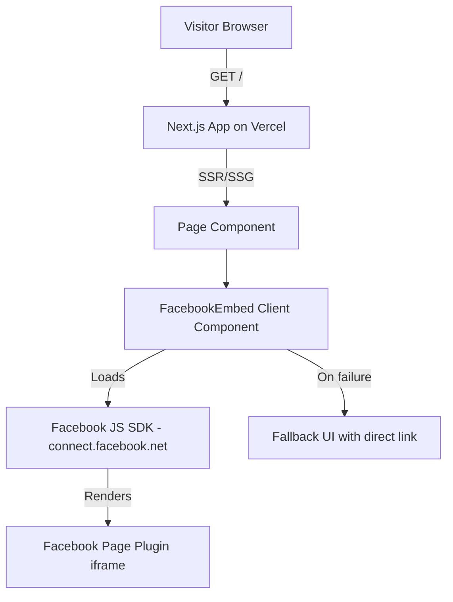

# Design Document: fb-page-posts

## Overview

This design describes a Next.js application that embeds a public Facebook page's timeline using the official Facebook Page Plugin. The plugin is loaded client-side via the Facebook JavaScript SDK, which renders an iframe containing the page's posts. No API keys or server-side tokens are required.

The application consists of a single page (`/`) with a responsive layout that centers the embedded plugin. A single environment variable (`NEXT_PUBLIC_FACEBOOK_PAGE_URL`) configures the target page. Fallback UI handles cases where the SDK fails to load or is blocked by the browser.

### Key Design Decisions

- **Client-side only rendering**: The Facebook JS SDK must run in the browser. The plugin component will use Next.js `"use client"` directive and load the SDK via a `<script>` tag or dynamic injection.
- **No API tokens**: The Facebook Page Plugin is a public embed widget. It requires only a page URL, not an access token.
- **Single env var**: `NEXT_PUBLIC_FACEBOOK_PAGE_URL` is a build-time public variable exposed to the client by Next.js's `NEXT_PUBLIC_` prefix convention.
- **Fallback-first approach**: A static fallback (direct link to the Facebook page) is rendered by default. The SDK replaces it with the live plugin on successful load.

## Architecture



### Component Tree

```
app/
├── layout.tsx          — Root layout with metadata
├── page.tsx            — Home page, renders FacebookEmbed
├── components/
│   └── FacebookEmbed.tsx  — Client component: loads SDK, renders plugin
└── globals.css         — Global styles including responsive layout
```

### Flow

1. Visitor requests `/`.
2. Next.js serves the page with the `FacebookEmbed` component.
3. `FacebookEmbed` (client component) checks for `NEXT_PUBLIC_FACEBOOK_PAGE_URL`.
   - If missing: renders a configuration error message.
4. Component renders a fallback `<div>` containing a direct link to the Facebook page.
5. Component injects the Facebook JS SDK script (`connect.facebook.net/en_US/sdk.js`).
6. On SDK load: calls `FB.XFBML.parse()` to convert the `<div class="fb-page">` markup into the live plugin iframe.
7. On SDK failure (timeout or error): displays a "temporarily unavailable" message.
8. If the browser blocks the script/iframe: the fallback link remains visible.

## Components and Interfaces

### `FacebookEmbed` (Client Component)

```typescript
// components/FacebookEmbed.tsx
'use client'

interface FacebookEmbedProps {
  pageUrl: string
}
```

**Responsibilities:**

- Inject the Facebook JS SDK script into the document
- Render the `<div class="fb-page">` markup with correct attributes
- Show a loading indicator while the SDK loads
- Show a fallback message if the SDK fails or is blocked
- Show a configuration error if `pageUrl` is empty/missing

**Plugin Markup (rendered by the component):**

```html
<div
  class="fb-page"
  data-href="{pageUrl}"
  data-tabs="timeline"
  data-width=""
  data-height="500"
  data-small-header="true"
  data-adapt-container-width="true"
  data-hide-cover="false"
  data-show-facepile="false"
>
  <blockquote cite="{pageUrl}" class="fb-xfbml-parse-ignore">
    <a href="{pageUrl}">Facebook Page</a>
  </blockquote>
</div>
```

**SDK Loading Strategy:**

- Dynamically create a `<script>` element pointing to `https://connect.facebook.net/en_US/sdk.js`
- Set `xfbml: true, version: 'v19.0'` in `FB.init()`
- Use a timeout (e.g., 10 seconds) to detect load failure
- On success: SDK auto-parses `fb-page` divs or we call `FB.XFBML.parse()`
- On failure: set an error state to show the fallback message

### `page.tsx` (Home Page)

```typescript
// app/page.tsx
export default function Home() {
  const pageUrl = process.env.NEXT_PUBLIC_FACEBOOK_PAGE_URL
  // Renders FacebookEmbed with pageUrl, or config error if missing
}
```

### `layout.tsx` (Root Layout)

Standard Next.js root layout with:

- HTML lang attribute
- Viewport meta for responsive behavior
- Global CSS import

## Data Models

This application has no persistent data models. All data is rendered by the Facebook Page Plugin iframe from Facebook's servers.

**Environment Configuration:**

| Variable                        | Type     | Required | Description                                                                    |
| ------------------------------- | -------- | -------- | ------------------------------------------------------------------------------ |
| `NEXT_PUBLIC_FACEBOOK_PAGE_URL` | `string` | Yes      | Full URL of the target Facebook page (e.g., `https://www.facebook.com/MyPage`) |

**Component State (`FacebookEmbed`):**

| State       | Type                              | Description                                  |
| ----------- | --------------------------------- | -------------------------------------------- |
| `sdkStatus` | `"loading" \| "ready" \| "error"` | Tracks the Facebook JS SDK loading lifecycle |

## Correctness Properties

_A property is a characteristic or behavior that should hold true across all valid executions of a system — essentially, a formal statement about what the system should do. Properties serve as the bridge between human-readable specifications and machine-verifiable correctness guarantees._

### Property 1: Plugin markup uses provided page URL

_For any_ valid Facebook page URL string passed to the `FacebookEmbed` component, the rendered output SHALL contain a `div.fb-page` element whose `data-href` attribute equals that URL.

**Validates: Requirements 1.2, 4.1, 4.3**

### Property 2: Fallback link matches page URL

_For any_ valid Facebook page URL string passed to the `FacebookEmbed` component, the initial rendered HTML SHALL contain an anchor (`<a>`) element whose `href` attribute equals that URL, serving as a fallback for blocked scripts/iframes.

**Validates: Requirements 1.5**

### Property 3: SDK script injection on render

_For any_ render of the `FacebookEmbed` component with a valid page URL, the component SHALL inject a `<script>` element with `src` containing `connect.facebook.net` into the document.

**Validates: Requirements 1.1**

## Error Handling

| Scenario                                                 | Behavior                                                                                                                                          |
| -------------------------------------------------------- | ------------------------------------------------------------------------------------------------------------------------------------------------- |
| `NEXT_PUBLIC_FACEBOOK_PAGE_URL` is missing/empty         | Render a configuration error message instead of the plugin. No SDK script is injected.                                                            |
| Facebook JS SDK fails to load (network error or timeout) | Set `sdkStatus` to `"error"`. Display a user-friendly message: "The Facebook feed is temporarily unavailable." Include a direct link to the page. |
| Browser blocks third-party scripts/iframes               | The fallback `<blockquote>` with a direct link to the Facebook page remains visible since the SDK never loads to replace it.                      |
| Invalid Facebook page URL                                | The plugin will render but show no content. This is handled by Facebook's widget — no custom error handling needed.                               |

## Testing Strategy

### Testing Framework

- **Unit/Component tests**: [Jest](https://jestjs.io/) + [React Testing Library](https://testing-library.com/docs/react-testing-library/intro/)
- **Property-based tests**: [fast-check](https://github.com/dubzzz/fast-check) (JavaScript/TypeScript PBT library)

### Property-Based Tests

Each correctness property maps to a single `fast-check` property test with a minimum of 100 iterations.

| Test        | Property   | Description                                                                                                                                                                                          |
| ----------- | ---------- | ---------------------------------------------------------------------------------------------------------------------------------------------------------------------------------------------------- |
| `test.prop` | Property 1 | Generate random valid URL strings, render `FacebookEmbed`, assert `data-href` matches. Tag: **Feature: fb-page-posts, Property 1: Plugin markup uses provided page URL**                             |
| `test.prop` | Property 2 | Generate random valid URL strings, render `FacebookEmbed`, assert fallback `<a>` href matches. Tag: **Feature: fb-page-posts, Property 2: Fallback link matches page URL**                           |
| `test.prop` | Property 3 | Generate random valid URL strings, render `FacebookEmbed`, assert script element with `connect.facebook.net` is present. Tag: **Feature: fb-page-posts, Property 3: SDK script injection on render** |

### Unit Tests (Examples & Edge Cases)

| Test                     | Criteria                     | Description                                                                                                                                        |
| ------------------------ | ---------------------------- | -------------------------------------------------------------------------------------------------------------------------------------------------- |
| Plugin config attributes | 1.3, 2.1, 2.2, 2.3, 2.4, 3.4 | Assert `data-tabs="timeline"`, `data-height="500"`, `data-small-header="true"`, `data-adapt-container-width="true"` are present in rendered markup |
| Loading indicator        | 2.5                          | Assert a loading indicator is visible while `sdkStatus` is `"loading"`                                                                             |
| SDK failure message      | 1.4                          | Simulate SDK load failure, assert error message is displayed                                                                                       |
| Missing env var          | 4.2                          | Render with empty/undefined URL, assert configuration error message is shown and no plugin markup is rendered                                      |
| Home page renders plugin | 5.4                          | Render the home page component, assert `FacebookEmbed` is present                                                                                  |
